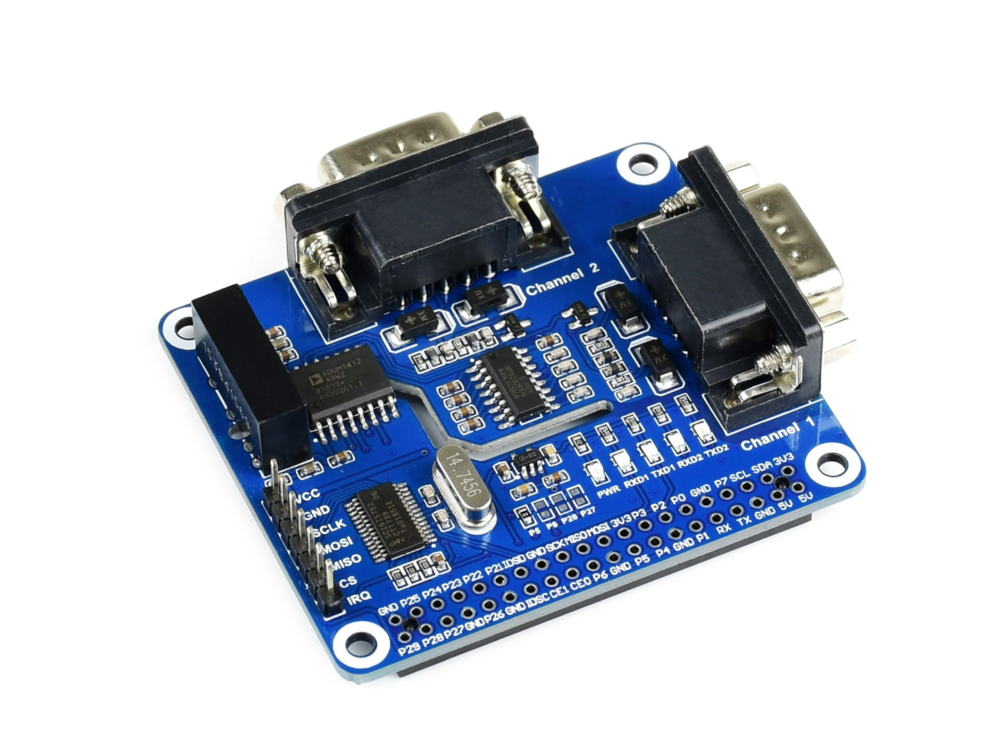

# 2-CH RS485 HAT
## waveshare electronics

http://www.waveshare.net  
https://www.waveshare.com  

## 中文 ## 
http://www.waveshare.net/shop/.htm  
我是专为树莓派设计的双通道隔离型RS232扩展板，采用SC16IS752+SP3232方案，内置电源隔离、ADI磁耦隔离和TVS等保护电路。 
我操作简单，通过SPI接口即可控制两路RS232通信，具有通信速度快、稳定、可靠、安全等特点，可适用于工业自动化等领域。

## English ##
https://www.waveshare.com/.htm  
I am a dual-channel isolated RS232 expansion board specially designed for the Raspberry Pi. It uses the SC16IS752 + SP3232 solution and has built-in power isolation, ADI magnetic coupling isolation, and TVS protection circuits.
I have simple operation and can control two RS232 communication via SPI interface. It has the characteristics of fast communication speed, stable, reliable and safe, and can be applied to industrial automation and other fields.

